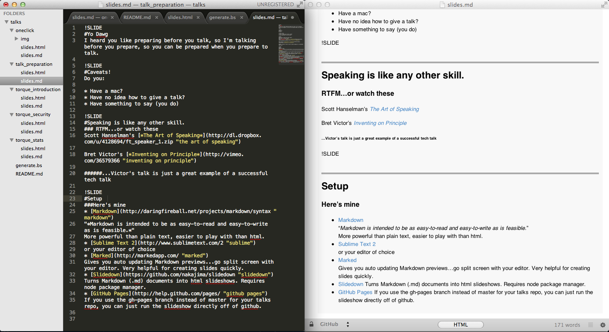

!SLIDE
#Talking The Talk
@pwmckenna  
Patrick Williams  

!SLIDE
#Caveats! 
Do you:  

* Have a mac?  
* Comfortable on the command line?  
(can you type "slidedown *filename.md* > *filename.html"?*)
* Have no idea how to give a talk, or prepare slides?  
* Have something to say (you do...even Brandon)  

!SLIDE
#Speaking is just a skill.
#### RTFM...or watch these
   
Scott Hanselman's [*The Art of Speaking*](http://dl.dropbox.com/u/4128694/ft_speaker_1.zip "the art of speaking")

Bret Victor's [*Inventing on Principle*](http://vimeo.com/36579366 "inventing on principle")
   
#######...Victor's talk is both a great example of a successful tech talk, and an inspiring look at how to nurture ideas.  

!SLIDE
#Setup  
###Here's mine
* [Markdown](http://daringfireball.net/projects/markdown/syntax "markdown")  
"*Markdown is intended to be as easy-to-read and easy-to-write as is feasible.*"  
More powerful than plain text, easier to play with than html.  
Markdown files end in *.md*
* [Sublime Text 2](http://www.sublimetext.com/2 "sublime")  
or your editor of choice
* [Marked](http://markedapp.com/ "marked")  
Gives you auto updating Markdown previews...go split screen with your editor. Very helpful for creating slides quickly.
* [Slidedown](https://github.com/nakajima/slidedown "slidedown")
Turns Markdown (.md) documents into html slideshows. Requires node package manager.

!SLIDE
#Helpful additions  
(not for creating slides directly, but very useful during the process)  
 
* [GitHub Pages](http://help.github.com/pages/ "github pages")  
Use the gh-pages branch. GitHub will host that content like a web server.  
*http://pwmckenna.github.com/talks/talk_preparation/slides.html*  
* [Optimal Layout](http://most-advantageous.com/optimal-layout/)  
Helps you quickly arrange windows side-by-side.

!SLIDE
#Workflow
* Sublime Text and Marked split screened.
* Type + Save -> Marked preview will update to show you formatted Markdown in realtime.

!SLIDE
#Syntax
* Denote a new slide with *!SLIDE*  
(Not valid Markdown, but is used by Slidedown to generate slides)
* Use *#* to give each slide a header
* Use * to create lists  
(these lines each started with *)
* End each line in two spaces to denote a line break

!SLIDE
#In Action

!SLIDE
#Why this setup?
* Instant feedback = very rapid editing...these slides took minutes
* Faster than HTML for simple slides (most of them)
* Markdown supports inline html, so if you want to customize, you can go nuts
* Supports custom css, inline or global

!SLIDE
#Go forth and speak
We don't know all of the technology  
We don't know everyone's role  
   
But we will...__when you tell us__